# E-Commerce Platform Deployment with Git, Linux and AWS
### The following steps are taken to deploy this project

## Steps: Initialize Git Repository
Begin by creating a project directory named **"MarketPeak_Ecommerce"**
Inside this directory, intialize a Git repo to manage version control.
```mkdir MarketPeak_Ecommerce
cd MarketPeak_Ecommerce
git init
```
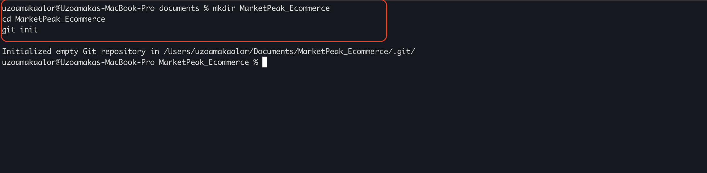

## Obtain and Prepare the E-Commerce Website Templete
Instead of building the website from scratch, we are using a pre-existing ecommerce template.
The website has been imported into the **"MarketPeak_Ecommerce"** directory.
run the code ```ls``` to view the content of the directory. Here the template has been successfully imported.
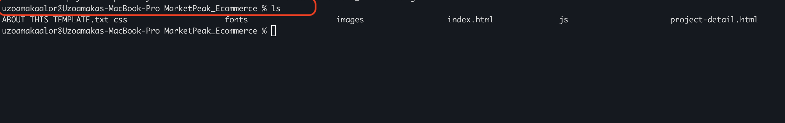

## Stage and Commit The Template to Git

Add the website files to the Git Repo
Set Git global configuration with username and email
Commit these changes with a clear, descriptive Message.
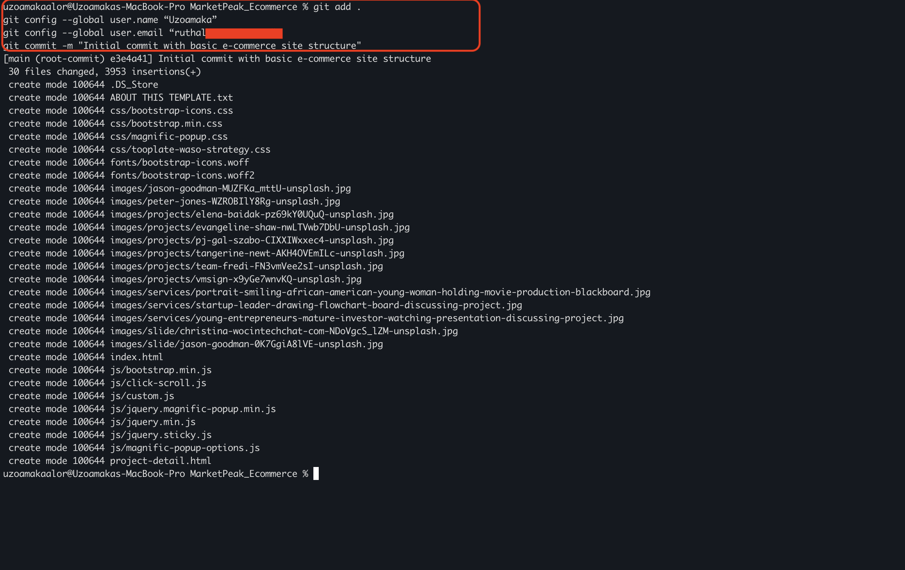

### Push the code to Github Repository
After initializing Git repo and adding the e-commerce template, next step is to push the code to a remote repository on Github. 
Follow these **steps**
- Create a Remote Repository on Github, name it **"MarketPeak_Ecommerce**
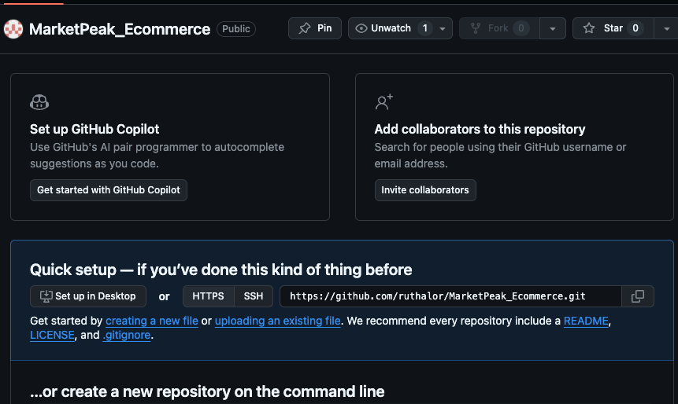
- Link Your Local Repository to Github within your project directory. 
```
git remote add origin https://github.com/your-git-username/MarketPeak_Ecommerce.git
```
- Push Your Code: Upload the local repo content to GitHub.
```
git push -u origin main
```
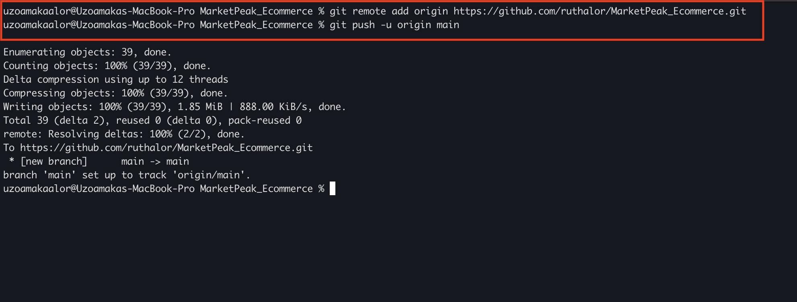

# AWS DEPLOYMENT

To deploy **"MarketPeak_Ecommerce"** platform, start by setting up Amazon EC2 instance:

- Log in to the AWS Management Console
- Launch an EC2 instance using an Amazon Linux AMI
- Set the Security Group to allow HTTP connection from any IP
- Connect to the instance using SSH
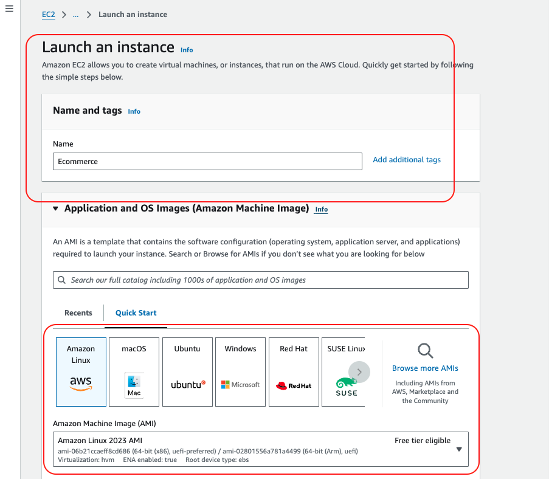
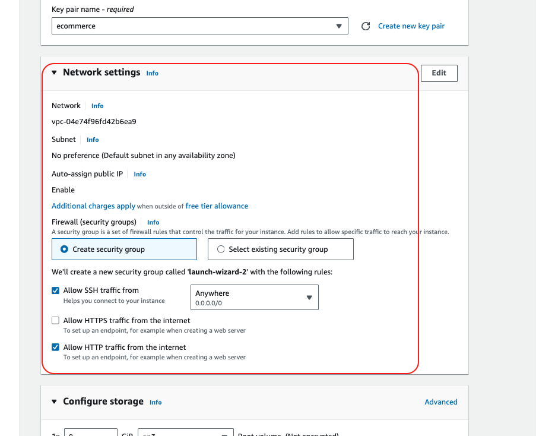

### Amazon Ec2 Instance has been launched
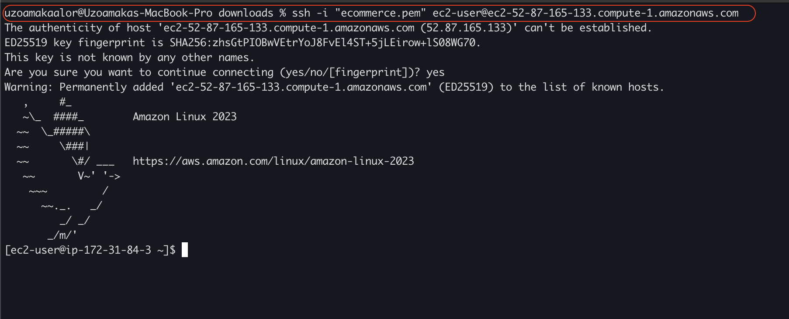

- Change to the **root** user, this gives you ```sudo``` privileges
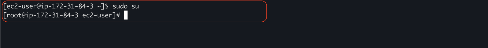

# Install Web Server on EC2
We are using **Apache** HTTP Server (httpd), this is a widely used web server that serves HTML files and contents over the internet. 

- Install Apache web server on the Ec2 instance, Note: httpd is the software name for Apache on systems using the yum package manager

```
sudo yum update -y
sudo yum install httpd -y
sudo systemctl start httpd
sudo systemctl enable httpd
```
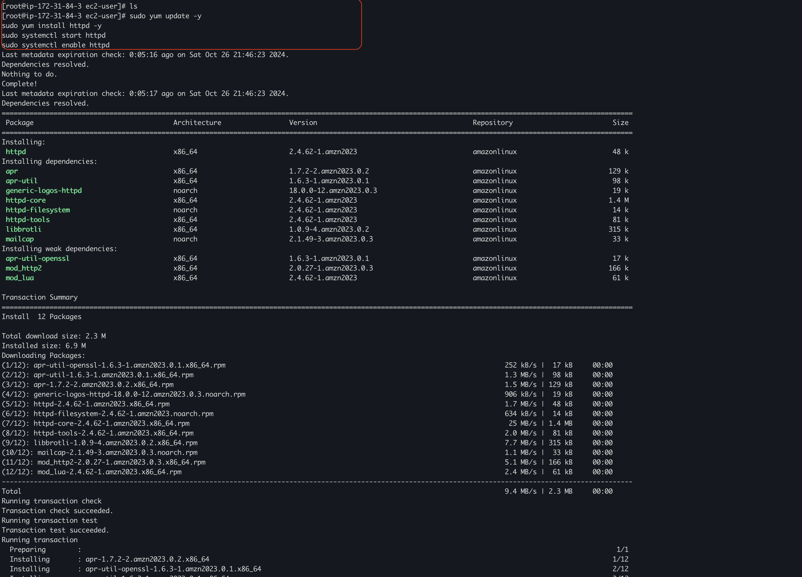

```cd``` into the apache server that has been installed

```cd /var/www/html```

install git with the code ```yum install git -y```
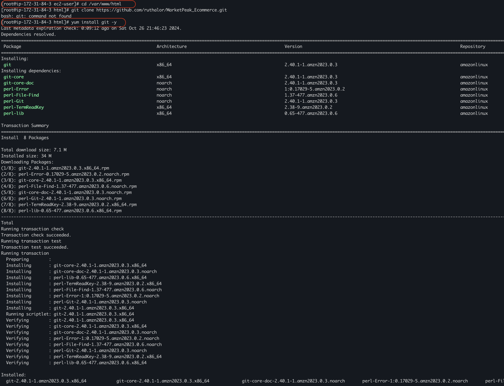

Use the **https** clone URL to clone the repository
```ls``` to view if successfully done.
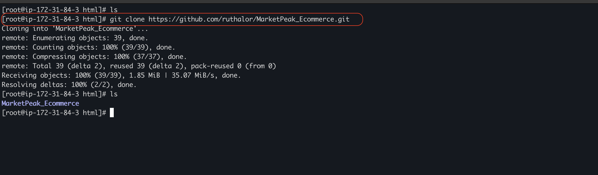

``cd`` into the cloned directory
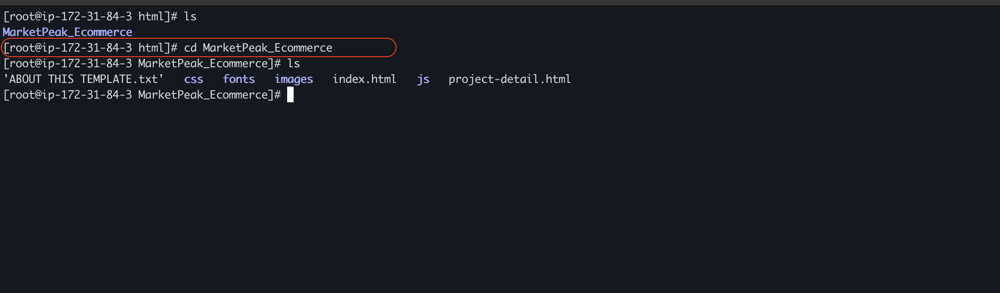
Now, we have to move the file contents to the document root (httpd)
run the command ``` mv * .. ```

- change directory back to ***document root** which is apache httpd
- ```ls``` to view the moved content
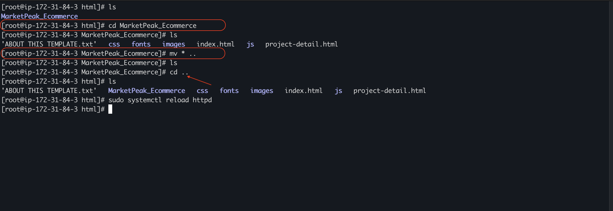

- reload the web server  ```sudo systemctl reload httpd```.

## Now its time to test the Job done so far.
- With ***httpd*** configured and website files in place, **MarketPeak_Ecommerce** platform is now live on the internet!!!

- Locate the public ip of your Web Server, Open a Web browser to view the deployed website.
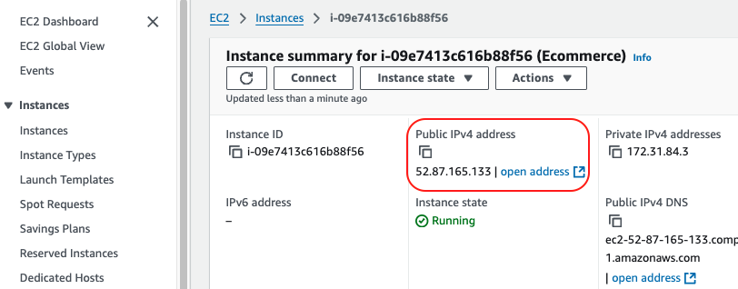


